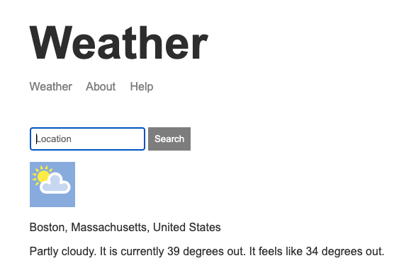

---

### [Weather App link](https://oliveira-weather-app.herokuapp.com/)
[github link](https://github.com/allan-io/weather-website)

 
 

| Techs Used| Description |
| ----------- | ----------- |
| Node.js | Javascript runtime |
| Express | Node.js web app server framework |
| MongoDB | Used as NOSQL database |
| Mongoose | Object Data Modeling library |
| Handlebars | Web templating engine |

 

### Description

This app uses asynchronous Javascript in order to make requests to multiple apis [weatherstack.com](https://weatherstack.com/documentation) and [mapbox.com](https://docs.mapbox.com/). You can search the weather anywhere in the world by many different types of querries such as zipcode, physical location, city, amongst others.
 

### Future Iterations

- add user login authentication
- save multiple weather forcast by location

 

### Dev Scripts

    
| Command| Description |
| ----------- | ----------- |
| npm install | install all dependencies |
| npm run dev | open localhost listening for changes on hbs and js files using nodemon |
| npm run start | deployment run script |

